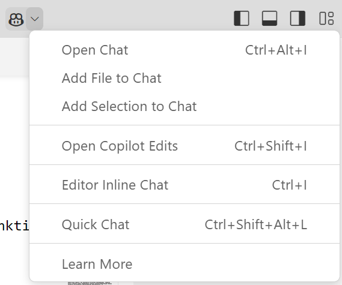

# GitHub Copilot alkeet

## Sisältö

Tässä oppaassa kerrotaan, miten GitHub Copilotia käytetään Visual Studio Codessa. Esimerkeissä käytetään Python- ja Java-ohjelmointikieliä. Oppaassa kerrotaan seuraavista Copilotin käyttöön liittyvistä asioista:
- Miten koodiehdotukset saa editoriin ja miten niitä hyödynnetään
- Miten käytetään chat-keskusteluja koodin refaktorointiin
- Miten korjataan virheitä

## Mallidatan generointi Inline Chatin avulla

Tehdään GitHub Copilotin avulla ohjelma, joka lukee tiedostosta dataa Suomen suurimmista kaupungeista. Ohjelma järjestää kaupungit eri parametrien mukaan.

Tietoja kaupungeista voitaisiin hakea esimerkiksi Tilastokeskuksen sivuilta. Tehdään tekstitiedosto kaupungeista nyt kuitenkin tekoälyn avulla.

Tee VS Codella tiedosto cities.txt. VS Coden editori tarjoaa heti tekoälyavustinta käyttöön. Paina Ctrl+I, kuten VS Code ehdottaa.


Näyttöön avautuvassa ikkunassa (Inline Chat) voi antaa koodiehdotuksia. Tällä kertaa pyydämme tekoälyä tekemään listan 30 suurimmasta kaupungista. Voit pyytää tekoälyä tekemään listan esimerkiksi näin:


Paina oikeassa reunassa olevaa nuolinäppäintä ja Copilot generoi tiedot.

Lista ei ole välttämättä vielä haluamassamme muodossa. Esimerkiksi alueiden nimet voivat olla osin englanninkielisiä. Voit tarkentaa kehotetta eli promptia ja generoida listan kaupungeista uudestaan. Voit antaa kehotteen myös suomeksi, mutta englanninkieliset kehotteet toimivat usein paremmin.


Kun kaupunkien tiedot ovat haluamassasi muodossa, paina Accept. Poista otsikkorivi alusta ja tallenna tiedosto.

Huomaa, että listassa olevat kaupunkien tiedot ovat epäluotettavia. Käytimme Copilotia nyt vain mallidatan luomiseksi.

## Ohjelmakoodin generointi Inline Chatin avulla

Pyydetään Copilotia nyt generoimaan Python-ohjelma, joka lukee cities.txt-tiedoston ja tekee kaupungeista listan olioita (käytetään sanakirja-tietorakennetta).

Tee uusi tiedosto readcities.py ja avaa Inline Chat. Kokeile seuraavaa promptia:
```
Make a program, which reads the file cities.txt. The program creates a list of city dictionaries.
```

Copilot ei välttämättä osaa huomioida tiedoston cities.txt kenttiä. Promptia täytyy todennäköisesti tarkentaa esimerkiksi näin:
```
Make a program, which reads the file cities.txt. The program creates a list of city dictionaries. Each row in the file contains the following fields: name, region, population, latitude and longitude.
```

Copilot ei välttämättä tuota hyvää ohjelmakoodia heti. Joskus Inline Chat ikkunan sulkeminen ja uudelleen yrittäminen saattaa auttaa. Promptausta voi myös edelleen tarkentaa.

Ohjelmakoodin pitäisi näyttää nyt suurin piirtein tältä:

```python
def read_cities(file_path):
    cities = []
    with open(file_path, 'r') as file:
        for line in file:
            name, region, population, latitude, longitude = line.strip().split(',')
            city = {
                'name': name,
                'region': region,
                'population': int(population),
                'latitude': float(latitude),
                'longitude': float(longitude)
            }
            cities.append(city)
    return cities

if __name__ == "__main__":
    file_path = 'cities.txt'
    cities = read_cities(file_path)
    for city in cities:
        print(city)
```

Kun ohjelma on valmis, kokeile ajaa se.

Voit myös myös pyytää Copilotia antamaan koodiehdotusta tiettyyn ohjelman osaan. Muutetaan ohjelmaa siten, että siinä on main-funktio. Maalaa ohjelman loppuosa (if-lause). Valitse Ctrl-I tai paina vasempaan reunaan ilmesteynyttä keltaista symbolia. Valitse sitten Modify using Copilot.


Anna Inline Chatille kehote:
```
Use main method
```

Ohjelman loppuosa näyttää nyt tältä:
```python
def main():
    file_path = 'cities.txt'
    cities = read_cities(file_path)
    for city in cities:
        print(city)

if __name__ == "__main__":
    main()
```

## Automaattinen koodin täydennys

Olet jo ehkä huomannut, että Copilot ehdottaa kooditäydennyksiä pyytämättäkin. Nämä ehdotukset näkyvät editorissa harmaana ja ne voi hyväksyä tabulaattorilla.

Koodiin kirjoitettuja kommentteja voi käyttää myös Copilotin kehotteena Inline Chatin sijaan.

Lisää seuraava kommentti main-funktioon:


Hyväksy koodiehdotus painamalla Tab.

Kirjoita vielä kommentti:
```python
# calculate total population
```

Hyväksy copilotin ehdotukset tabulaattorilla rivi kerrallaan. Main-funktio on nyt tällainen:
```python
def main():
    file_path = 'cities.txt'
    cities = read_cities(file_path)
    # sort cities by name
    cities = sorted(cities, key=lambda city: city['name'])
    for city in cities:
        print(city)
    # calculate total population
    total_population = sum(city['population'] for city in cities)
    print('Total population:', total_population)
```

## Copilot Chat yleisiin ohjelmointikysymyksiin

Copilot Chatiltä voi kysyä yleisiä ohjelmointiin liittyviä kysymyksiä. Saat avattua Copilot Chat -keskusteluikkunan sivulle painamalla Ctrl-Alt-I tai valitsemalla sen ylhäältä valikosta:



Chat-ikkuna ilmestyy ikkunan oikeaan reunaan. Kehotteen voi kirjoittaa ikkunan alareunassa olevaan tekstikenttään.

Kysytään, miten ohjelmaa pitäisi muokata, jos kaupunkien tallentamiseen käytetään olioita sanakirjan sijaan. Maalaa city-sanakirja ja avaa Chat-ikkuna. Anna seuraava kehote Chat-ikkunan alaosassa:
Kirjoita seuraava ohje kehotekenttään:
```
Use object of a class here instead of dictionary. 
```


Copilot antaa Chat-ikkunassa City-luokan ohjelmakoodin. Copilot saattaa kertoa myös, mitä muutoksia reademployees.py-tiedostoon täytyy tähdä. Näin ei kuitenkaan nyt jäynyt, eli tehdään nyt vain City-luokka ja muutetaan reademployees.py-tiedostoa myöhemmin.

Tee uusi tiedosto city.py ja kopioi sinne Copilot Chatin ehdottama koodi:
```python
# city.py
class City:
    def __init__(self, name, region, population, latitude, longitude):
        self.name = name
        self.region = region
        self.population = int(population)
        self.latitude = float(latitude)
        self.longitude = float(longitude)
```

Pyydetään vielä Copilotia ohjeistamaan, mitä pitää huomioida, jos City-luokka tehdään erilliseen tiedostoon:
Kirjoita seuraava ohje kehotekenttään:
```
Define the City class to separate file 
```

Copilot Chat kertoo, että readcities.py-tiedoston alkuun kirjoitetaan:
```python
from city import City 
```

Avaa readcities.py ja lisää edellä mainittu import-lause. Maalaa sitten kaikki koodi readcities.py-tiedostosta. Avaa seuraavaksi Inline Chat ja anna sille kehote:
```
Use objects of city class instead of dictionary
```


Hyväksy muutokset. Ohjelma ei kuitenkaan toimi oikein, jos City-luokasta puuttuu __str__-metodi. Lisää se City-luokkaan tekoälyn avulla.

```python
# __str__ method is used to return a string representation of the object.
    def __str__(self):
        return f'{self.name} ({self.region}): {self.population}'
```

## Muutokset useampaan tiedostoon

Uuden toiminnallisuuden tekeminen kohdistuu usein useampaan tiedostoon. Pyydetään Copilotia muokkaamaan ohjelmaa siten, että laskee etäisyyden ensimmäisen kaupungin ja kaikkien muiden kaupunkien välillä. Etäisyyden laskeva funktio sijoitetaan City-luokkaan.

Koska muutokset koskevat nyt kahta tiedostoa, voit auttaa Copilotia kertomalla sille ohjelman kontekstin. Kirjoita kehotteeseen ensin @workspace ja sitten tiedoston nimet #-merkillä alkaen:

```
@workspace #city.py #readcities.py Add function distance to the City class which calculates the distance between this city and another city. In the main program claculate the distance between the first city and other cities

```
Copilot Chat kertoo nyt, mitä muutoksia näihin tiedostoihin tarvitaan. Joudut kopioimaan muuttuneet kohdat käsin (tai tiedostot kokonaisuudessaan).

Toinen vaihtoehto on käyttää Copilot Edits -ikkunaa, jolle määritellään tiedostot, jota muutokset koskevat. Copilot Edits osaa tehdä tarvittavat muutokset suoraan näihin tiedostoihin. Tätä kirjoitettaessa Copilot Edits on vasta Preview-vaiheessa ja ehdotetut koodilisäykset eivät ole välttämättä kovin luotettavia. Kannattaa kuitenkin kokeilla!

Huomaa, että GitHub Copilot voi antaa eri kerroilla erilaisia koodiehdotuksia ja promptaamisen tarkentamisen tarve voi vaihdella. Copilot "oppii" koulutehtävät nopeasti ja yleisimmissä koulutehtävissä saattaa riittää, että kirjoittaa vain vähän ohjelman alkua.

## Yleistä GitHub Copilotista

GitHub Copilot on tekoälyyn pohjautuva ohjelmointityökalu, joka osaa tehdä ja täydentää ohjelmakoodia. Copilotille kuvataan ohjelmointitehtävä luonnollisella kielellä ja se tuottaa ratkaisun annettuun tehtävään valitulla ohjelmointikielellä. Haluttu uusi ohjelman toiminto voidaan kuvata esimerkiksi syöteikkunassa tai kuvaus voidaan kirjoittaa ohjelmakoodin kommentteihin. Copilot osaa myös ehdottaa seuraavia koodirivejä samalla, kun ohjelmoija kirjoittaa ohjelmakoodia. Tekoälyn avulla tuotetut koodin täydennykset auttavat ohjelmistokehittäjää etenkin vaikeasti muistettavien yksityiskohtien ohjelmoinnissa, ja ohjelmistokehittäjä voi keskittyä haastavampiin ohjelmistotehtäviin. Copilot toimii muun muassa Visual Studio Code (VS Code) -kehitystyökalussa.

Copilotia markkinoidaan tekoälypohjaisena pariohjelmoijana, jolta voi kysyä ohjeita ohjelmointityön aikana. Sitä voi pyytää selittämään annettua ohjelmakoodia tai virheilmoituksia. Virhetilanteissa se selittää ongelman ja antaa korjausehdotuksen. Copilot on myös hyödyllinen yksikkötestien laatimisessa. Työkalu osaa generoida suurempia koodikokonaisuuksia, jotka jakaantuvat useisiin ohjelmistomoduuleihin. Copilot toimii parhaiten, kun sille on annettu tietoa kehitettävän ohjelman kontekstista. Käytännössä tämä tarkoittaa sitä, että Copilotille kerrotaan, mitä ohjelmakoodia sen tulee huomioida koodiehdotuksia varten.

Useimmat ohjelmistokehittäjät käyttää nykyään GitHub Copilotia tai vastaavaa tekoälypohjaista ohjelmointityökalua. Ohjelmointityössä täytyy jatkuvasti hakea tietoa esimerkiksi ohjelmistokirjastojen ja rajapintojen käytöstä. Ohjelmistokehittäjät käyttävät myös useita ohjelmointikieliä ja sovelluskehyksiä, ja näihin liittyvien yksityiskohtien muistaminen ei ole mielekästä eikä edes mahdollista. Tekoälypohjaiset koodiavustajat nopeuttavat usein tiedonhankintaa web-sivujen selaamiseen verrattuna.

Toisaalta monet ovat huolissaan tekoälypohjaisten työkalujen vaikutuksesta ohjelmistojen laatuun. Kielimallien ongelma ohjelmistokehityksessä on, että niiden on vaikea ”hahmottaa” suuria useisiin tiedostoihin jakautuneita ohjelmistoprojekteja. Copilot ei selviydy vielä kovin hyvin tilanteesta, jossa uuden toiminnon lisääminen ohjelmaan vaatii muutoksia useisiin tiedostoihin. Myös ohjelmistokoodin uudelleenkäytössä on puutteita, koska kielimallit eivät osaa nykyisellään yleistää koodia. Tutkimuksissa on havaittu, että ohjelmakoodin uudelleenkäyttö on vähentynyt AI-työkalujen yleistyttyä. 

Kielimallit tuottavat varsin hyviä vastauksia melkein mihin vain tyypillisiin koulutehtäviin, joita esiintyy esimerkiksi lukioissa ja korkeakoulujen perusopinnoissa. Ohjelmoinnissa tilanne on sama kuin muissa aineissa. ChatGPT ja Copilot osaavat ratkaista suurimman osan ohjelmoinnin peruskurssien tehtävistä pelkän tehtävänannon perusteella. 

 Monet ohjelmoinnin opettajat ovat sitä mieltä, että opiskelijan ei kannattaisi käyttää tekoälyä ohjelmoinnin peruskurssien opiskelussa. Esimerkiksi Helsingin yliopiston suositussa Full Stack open -opiskelumateriaalissa annetaan suositus, että opiskelija kytkee Copilotin pois päältä ja turvautuu siihen ainoastaan silloin, kun muu ei auta. Tekoälyn olemassaoloa ei voi kuitenkaan piilottaa edes ohjelmoinnin perusteiden opiskelijoilta. Alkeisopinnoissakin tekoälystä voi olla opiskelijalle hyötyä esimerkiksi ohjelmakoodin selittäjänä. Kun ohjelmoinnin perustaidot ovat hallussa, tekoälypohjaisten koodiavustinten tehokasta käyttöä on myös syytä opiskella. Ohjelmoijan on osattava tuottaa itse algoritmeja, vaikka ne saakin generoitua helposti tekoälyn avulla. Ilman kunnollista ohjelmointiosaamista suunnittelija ei pysty arvioimaan tekoälyn tuottaman koodin oikeellisuutta ja tarkoituksenmukaisuutta.