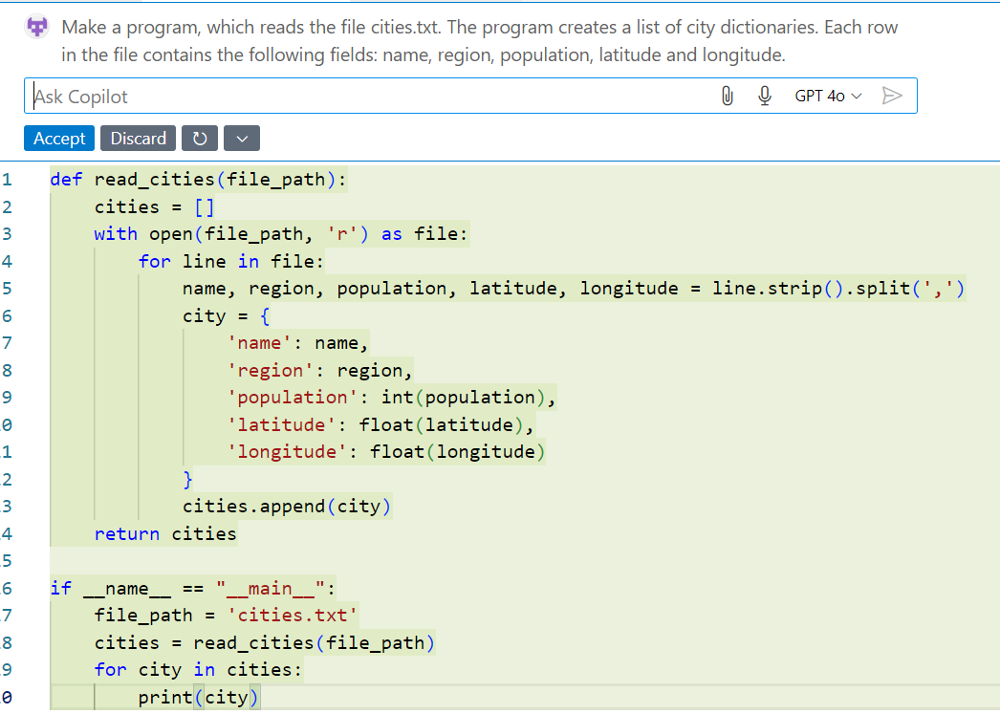
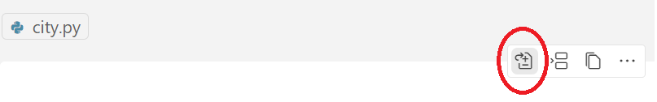
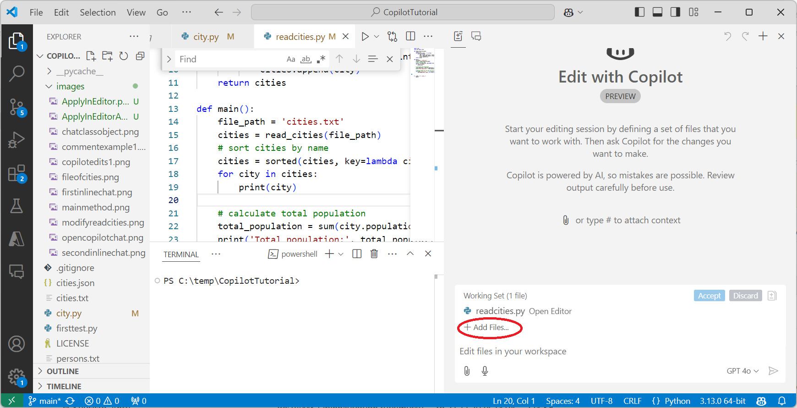

# GitHub Copilot -koodiavustimen käytön alkeet

## Sisältö

Tässä oppaassa näytetään, miten tekoälypohjaista GitHub Copilot -koodiavustinta käytetään Visual Studio Codessa. Oppaassa kerrotaan seuraavista Copilotin käyttöön liittyvistä asioista:
- Miten koodiehdotukset saa editoriin ja miten niitä hyödynnetään
- Miten käytetään chat-keskusteluja koodin refaktorointiin ja selittämiseen
- Miten korjataan virheitä Copilotin avulla
- Miten käsitellään useampaan tiedostoon kohdistuvia muutosehdotuksia Copilot Chatillä ja Copilot Editsillä.

## GitHub Copilot

GitHub Copilot on tekoälyyn pohjautuva ohjelmointityökalu, joka osaa luoda ja täydentää ohjelmakoodia. Copilotille kuvataan ohjelmointitehtävä luonnollisella kielellä ja se tuottaa ratkaisun annettuun tehtävään valitulla ohjelmointikielellä. Haluttu uusi ohjelman toiminto voidaan kuvata esimerkiksi Chat-ikkunassa tai kuvaus voidaan kirjoittaa ohjelmakoodin kommentteihin. Copilot osaa myös ehdottaa seuraavia koodirivejä samalla, kun ohjelmoija kirjoittaa ohjelmakoodia. Tekoälyn avulla tuotetut koodin täydennykset auttavat ohjelmistokehittäjää etenkin vaikeasti muistettavien yksityiskohtien ohjelmoinnissa, ja ohjelmistokehittäjä voi keskittyä haastavampiin ohjelmistotehtäviin. Copilot toimii muun muassa Visual Studio Codessa (VS Code).

Copilotia markkinoidaan tekoälypohjaisena pariohjelmoijana, jolta voi kysyä ohjeita ohjelmointityön aikana. Copilotia voi pyytää myös selittämään annettua ohjelmakoodia tai virheilmoituksia. Virhetilanteissa Copilot selittää ongelman ja antaa korjausehdotuksen. Copilot on myös hyödyllinen yksikkötestien laatimisessa. Työkalu osaa generoida suurempia koodikokonaisuuksia, jotka jakaantuvat useisiin ohjelmistomoduuleihin. Copilot toimii parhaiten, kun sille on annettu tietoa kehitettävän ohjelman kontekstista. Käytännössä tämä tarkoittaa sitä, että Copilotille kerrotaan, mitä ohjelmakoodia sen tulee huomioida koodiehdotuksia varten.

Tämä opas on tarkoitettu aloittelevalle GitHub Copilotin käyttäjälle, jolla on jo ohjelmoinnin perustaidot. Esimerkeissä käytetään Python-ohjelmointikieltä, mutta oppaassa kuvattuja menetelmiä voi soveltaa myös muilla ohjelmointikielillä.

## GitHub Copilotin asentaminen VS Codeen

GitHub Copilotia varten tarvitaan Visual Studio Code ja GitHub-tili. Asennusohjeet löytyvät sivulta [Installing the GitHub Copilot extension in your environment](https://docs.github.com/en/copilot/managing-copilot/configure-personal-settings/installing-the-github-copilot-extension-in-your-environment).

Varmista ensin, että sinulla on pääsy GitHub Copilotiin. Ohjeet ovat sivulla [Getting access to Copilot](https://docs.github.com/en/copilot/about-github-copilot/what-is-github-copilot#getting-access-to-copilot). 

Jos olet opiskelija tai opettaja, älä avaa ilmaista kokeilujaksoa. Opiskelijat saavat käyttää GitHub Copilotia yleensä ilmaiseksi. Hanki pääsy GitHub Copilotiin näiden ohjeiden avulla: [Getting free access to Copilot as a student, teacher, or maintainer](https://docs.github.com/en/copilot/managing-copilot/managing-copilot-as-an-individual-subscriber/managing-your-copilot-subscription/getting-free-access-to-copilot-as-a-student-teacher-or-maintainer).

Asenna seuraavaksi GitHub Copilot -laajennus Visual Studio Codeen: [GitHub Copilot extension](https://docs.github.com/en/copilot/managing-copilot/configure-personal-settings/installing-the-github-copilot-extension-in-your-environment).

## Esimerkkisovellus

Tutustutaan ensin tekoälyavustimen käyttöön tekemällä yksinkertainen esimerkkisovellus Copilotin avulla. Esimerkkisovellus lukee tiedostosta dataa Suomen suurimmista kaupungeista. Ohjelma järjestää kaupungit eri parametrien mukaan ja käsittelee kaupunkeja alueittain.

Harjoituksessa perehdytään ensin Inline Chatin käyttöön. Tämän jälkeen kokeillaan Copilot Chatiä koodin selittämiseen ja yleisiin ohjelmointiin liittyviin kysymyksiin. Lopuksi tutustutaan Copilot Edits- työkaluun, jolla voi tehdä tehokkaasti useampaan tiedostoon kohdistuvia muutoksia.

## Inline Chat

Kun luot uuden tiedoston VS Codella, tarjoaa editori heti mahdollisuutta Inline Chat -avustimen käyttöön. Inline Chatin saa päälle painamalla Ctrl+I, kuten VS Code ehdottaa.


Inline Chat aukeaa koodieditoriin tiedostokohtaisesti. Tekoälyn avulla käytävä keskustelu kohdistuu siis avoinna olevaan tiedostoon.

Inline Chatin lisäksi keskustelua voi käydä myös tavallisessa Chat-ikkunassa, joka avautuu ruudun oikealle puolelle omaan ikkunaansa. Chat-ikkunan käytöstä kerrotaan tässä oppaassa myöhemmin.

### Mallidatan generointi Inline Chatin avulla

Tehdään ensin tekstitiedosto kaupungeista tekoälyn avulla. Oikea tapa tuottaa tiedosto olisi tietenkin hakea tiedot luotettavasta lähteestä. Tekoälyn tuottamat tiedot kelpaavat kuitenkin hyvin tähän harjoitukseen.

Tee VS Codella tiedosto cities.txt. VS Coden editori tarjoaa heti tekoälyavustinta käyttöön. Paina Ctrl+I, kuten VS Code ehdottaa. Näyttöön avautuvassa ikkunassa Inline Chat-ikkunassa voi antaa koodiehdotuksia. Tällä kertaa pyydämme tekoälyä kuitenkin generoimaan dataa tekstimuodossa.

Pyydä tekoälyä tekemään listan Suomen 30 suurimmasta kaupungista esimerkiksi seuraavalla kehotteella:

```
Create a CSV file of 30 largest cities in Finland. Use the following fields: name, region, population, latitude and longitude.
```


Paina oikeassa reunassa olevaa nuolinäppäintä ja Copilot generoi tiedot.

Lista ei ole välttämättä vielä haluamassasi muodossa. Esimerkiksi alueiden nimet voivat olla osin englanninkielisiä. Voit tarkentaa kehotetta eli promptia ja generoida listan kaupungeista uudestaan. Voit antaa kehotteen myös suomeksi, mutta englanninkieliset kehotteet toimivat usein paremmin.


Kun kaupunkien tiedot ovat haluamassasi muodossa, paina Accept. Poista otsikkorivi tiedoston cities.txt alusta ja tallenna tiedosto.

### Ohjelmakoodin generoiminen Inline Chatin avulla

Pyydetään Copilotia nyt generoimaan Python-ohjelma, joka lukee cities.txt-tiedoston ja tekee kaupungeista listan olioita (käytetään luokkien ja olioiden sijaan sanakirja-tietorakennetta).

Tee uusi tiedosto readcities.py ja avaa Inline Chat. Kokeile seuraavaa promptia:

```
Make a program, which reads the file cities.txt. The program creates a list of city dictionaries.
```

Copilot ei välttämättä osaa huomioida tiedoston cities.txt kenttiä. Promptia täytyy todennäköisesti tarkentaa kuvaamalla tiedoston sisältöä:

```
Make a program, which reads the file cities.txt. The program creates a list of city dictionaries. Each row in the file contains the following fields: name, region, population, latitude and longitude.
```

Paina nyt nuolinäppäintä. Inline Chat generoi koodiehdotuksen, jonka voit hyväksyä painamalla Accept.



Copilot ei tuota aina hyvää ohjelmakoodia. Joskus Inline Chat ikkunan sulkeminen ja uudelleen avaaminen saattaa auttaa. Promptausta voi myös edelleen tarkentaa.

Ohjelmakoodin pitäisi näyttää nyt suurin piirtein tältä:

```python
def read_cities(file_path):
    cities = []
    with open(file_path, 'r') as file:
        for line in file:
            name, region, population, latitude, longitude = line.strip().split(',')
            city = {
                'name': name,
                'region': region,
                'population': int(population),
                'latitude': float(latitude),
                'longitude': float(longitude)
            }
            cities.append(city)
    return cities

if __name__ == "__main__":
    file_path = 'cities.txt'
    cities = read_cities(file_path)
    for city in cities:
        print(city)
```

Kun ohjelma on valmis, kokeile ajaa se.

Voit pyytää Copilotia antamaan koodiehdotusta myös tiettyyn ohjelman osaan. Muutetaan ohjelmaa siten, että siinä on main-funktio. Maalaa ohjelman loppuosa (if-lause). Paina sitten vasempaan reunaan ilmesteynyttä keltaista symbolia ja valitse Modify using Copilot. Vaihtoehtoisesti voit painaa Ctrl-I.


Anna Inline Chatille kehote:

```
Use main method
```

Ohjelman loppuosa näyttää nyt tältä:

```python
def main():
    file_path = 'cities.txt'
    cities = read_cities(file_path)
    for city in cities:
        print(city)

if __name__ == "__main__":
    main()
```

Testaa ohjelman toiminta ajamalla se.

### Automaattinen koodin täydennys

Olet ehkä jo huomannut, että Copilot ehdottaa kooditäydennyksiä jopa pyytämättäkin. Nämä ehdotukset näkyvät editorissa harmaana ja ne voi hyväksyä tabulaattorilla.

Koodiin kirjoitettuja kommentteja voi käyttää myös Copilotin kehotteena Inline Chatin sijaan.

Lisää kommentti ```#sort cities by name``` main-funktioon:


Hyväksy koodiehdotus painamalla Tab.

Kirjoita ohjelman loppuun vielä kommentti:

```python
# calculate total population
```

Hyväksy copilotin ehdotukset tabulaattorilla rivi kerrallaan. Main-funktio on nyt tällainen:

```python
def main():
    file_path = 'cities.txt'
    cities = read_cities(file_path)
    # sort cities by name
    cities = sorted(cities, key=lambda city: city['name'])
    for city in cities:
        print(city)
    # calculate total population
    total_population = sum(city['population'] for city in cities)
    print('Total population:', total_population)
```

Tallenna muutokset ja aja ohjelma.

## Copilot Chat yleisiin ohjelmointikysymyksiin

Inline Chat sopii hyvin lyhyiden ohjelman osien tekemiseen. Sen sijaan yleisiä ohjelmointiin liittyviä kysymyksiä on parempi kysyä Copilot Chatiltä. Saat avattua Copilot Chat -keskusteluikkunan painamalla Ctrl-Alt-I tai valitsemalla sen ylhäältä valikosta:


Chat-ikkuna ilmestyy ikkunan oikeaan reunaan. Kehotteen voi kirjoittaa ikkunan alareunassa olevaan tekstikenttään.

Kysytään, miten ohjelmaa pitäisi muokata, jos kaupunkien tallentamiseen käytetään olioita sanakirjan sijaan.

Maalaa city-sanakirja ja avaa Chat-ikkuna. Anna seuraava kehote Chat-ikkunan alaosassa:

```
Use object of a class here instead of dictionary. Define the City class in a separate file. 
```


Copilot antaa Chat-ikkunassa City-luokan ohjelmakoodin. Copilot kertoo myös, mitä muutoksia readcities.py-tiedostoon täytyy tähdä.

Aktivoi Chat-ikkunasta koodiehdotus tiedostolle city.py. Chatin koodi-ikkunan oikeaan yläkulmaan ilmestyy valikko, josta voit tehdä koodiehdotukseen liittyviä toimintoja.


Valitse kolme pistettä ja sitten Insert into New File.


Copilot Chat tekee nyt uuden tiedoston city.py ja kopioi koodiehdotuksen sinne. Vaihtoehtoisesti voit tehdä tiedoston city.py itse ja kopioida koodiehdotuksen Chat-ikkunasta sinne.

Tiedoston city.py ohjelmakoodi näyttää nyt tältä:

```python
# city.py
class City:
    def __init__(self, name, region, population, latitude, longitude):
        self.name = name
        self.region = region
        self.population = int(population)
        self.latitude = float(latitude)
        self.longitude = float(longitude)
```

Avaa editoriin readcities.py. Aktivoi sitten Chat-ikkunan puolelta koodiehdotus tiedostolle readcities.py.


Valitse Chat-ikkunan readcities.py-koodi-ikkunan valikosta ensimmäinen symboli Apply In Editor.



Editorin puolella näkyy nyt readcities.py-tiedostoon tehdyt muutokset.


Hyväksy muutokset painamalla Accept Changes. Tallenna tiedosto ja aja ohjelma.

Ohjelma ei kuitenkaan toimi oikein, jos City-luokasta puuttuu ```__str__```-metodi. Lisää se City-luokkaan Inline Chatin avulla. 

```python
# __str__ method is used to return a string representation of the object.
    def __str__(self):
        return f'{self.name} ({self.region}): {self.population}'
```

## Muutokset useampaan tiedostoon Copilot Chatin avulla

Uuden toiminnallisuuden tekeminen kohdistuu usein useampaan tiedostoon. Pyydetään Copilotia muokkaamaan ohjelmaa siten, että se laskee etäisyyden ensimmäisen kaupungin ja kaikkien muiden kaupunkien välillä. Etäisyyden laskeva funktio sijoitetaan City-luokkaan.

Koska muutokset koskevat nyt kahta tiedostoa, voit auttaa Copilotia kertomalla sille ohjelman kontekstin. Kirjoita kehotteeseen ensin @workspace ja sitten tiedostojen nimet #-merkkien perään:

```
@workspace #city.py #readcities.py Add function distance to the City class which calculates the distance between this city and another city. In the main program calculate the distance between the first city and other cities

```
Copilot Chat kertoo nyt, mitä muutoksia näihin tiedostoihin tarvitaan. Muutokset voi kopioida ohjelmakooditiedostoon painamalla Chatin koodi-ikkunan yläosassa olevaa Apply in Editor -symbolia.


Avaa nyt city.py editorin puolella ja vastaava koodi-ikkuna Chatin puolella. Paina sitten Apply in Editor -symbolia. Koodiehdotus tulee nyt editorin puolelle tiedostoon city.py korostusvärillä.


Paina Accept Changes -painiketta hyväksyäksesi muutokset.

Seuraava symboli työkalurivissä on Insert at Cursor, jolla voit lisätä generoidun koodin kursorin kohtaan ohjelmakooditiedostossa. Kolmen pisteen takaa löytyy myös toiminto, jolla voit lisätä generoidun koodin uuteen tiedostoon.

Avaa sitten readcities.py editorissa ja vastaava koodi chat-ikkunassa. Paina sitten Accept Changes -painiketta hyväksyäksesi muutokset.


Tallenna tiedostot city.py ja readcities.py ja aja ohjelma.

## Muutokset useampaan tiedostoon Copilot Edits -työkalulla

Toinen vaihtoehto tehdä muutoksia useampaa tiedostoon on käyttää Copilot Edits -ikkunaa. Copilot Editsille määritellään tiedostot, jota muutokset koskevat. Copilot Edits osaa tehdä tarvittavat muutokset suoraan näihin tiedostoihin. Tätä kirjoitettaessa Copilot Edits on vasta Preview-vaiheessa ja ehdotetut koodilisäykset eivät ole välttämättä luotettavia.

Avaa Copilot Edits valikosta tai painamalla Ctrl-Shift-I.


Copilot Edits avautuu ikkunan oikealle puolelle.



Lisätään ohjelmaan kaupunkien pinta-alojen käsittely.

Lisää tiedostot readcities.py, city.py ja cities.txt Editsille (+Add Files). Voit myös raahata tiedostot VS Coden explorer-listasta Copilot Editsin ikkunaan. 

Anna seuraavaksi Copilot Editsille kehote:

```
Add handling of the area (in square kilometers) of the cities to the program.

```


Paina sitten nuolinäppäintä kehotekentässä.

Copilots Edits generoi nyt muutosehdotukset eri tiedostoihin ja näyttää muutokset korostusväreillä. Voit valita käsiteltävän tiedoston listasta.


Voit hyväksyä kaikki muutokset kerralla painamalla Accept Copilot Edits -listassa. On kuitenkin parempi tarkistaa muutokset ja hyväksyä ne yksi kerrallaan valitsemalla tiedoston listasta. Kukin muutettu tiedosto täytyy vielä tallentaa.

Copilot Edits lisäsi cities.txt uuden sarakkeen pinta-aloja varten. Tiedostoon city.py lisättiin jäsenmuuttuja area konstruktoriin ja ```__str__```-metodiin. Tiedostoon readcities.py tehtiin useita muutoksia, että pinta-alat saadaan luettua tiedostosta.

Testaa nyt ohjelma ajamalla se.

Tehdään vielä toinen kokeilu Copilot Editsillä. Siirretään kaupunkien välinen etäisyyksien laskenta luokasta City staattiseksi funktioksi omaan tiedostoonsa.

Anna seuraava kehote:

```
Move the distance calcution from the city class to a static funtion in a separate file

```

Copilot Edits kertoo poistaneensa distance-metodin luokasta City ja lisänneensä uuden tiedoston distance.py, jossa on etäisyyksien laskenta. Lisäksi Copilot kertoi päivittäneensä main-funktiota niin, että se käyttää uutta metodia.

Huomaa, että GitHub Copilot voi antaa eri kerroilla erilaisia koodiehdotuksia ja promptaamisen tarkentamisen tarve voi vaihdella. Copilot "oppii" koulutehtävät nopeasti ja yleisimmissä koulutehtävissä saattaa riittää, että kirjoittaa vain vähän ohjelman alkua. Koulutehtävissä Copilot arvaa usein ehkä hieman liiankin helposti, mitä aiot seuraavaksi tehdä.

## Muutamia huomioita tekoälyavustinten käytöstä ohjelmoinnissa

Useimmat ohjelmistokehittäjät käyttää nykyään GitHub Copilotia tai vastaavaa tekoälypohjaista ohjelmointityökalua. Ohjelmointityössä täytyy jatkuvasti hakea tietoa esimerkiksi ohjelmistokirjastojen ja rajapintojen käytöstä. Ohjelmistokehittäjät käyttävät myös useita ohjelmointikieliä ja sovelluskehyksiä, ja näihin liittyvien yksityiskohtien muistaminen ei ole mielekästä eikä edes mahdollista. Tekoälypohjaiset koodiavustajat nopeuttavat usein tiedonhankintaa web-sivujen selaamiseen verrattuna.

Toisaalta monet ovat huolissaan tekoälypohjaisten työkalujen vaikutuksesta ohjelmistojen laatuun. Kielimallien ongelma ohjelmistokehityksessä on ollut, että niiden on vaikea ”hahmottaa” suuria useisiin tiedostoihin jakautuneita ohjelmistoprojekteja. Aiemmissa tutkimuksissa on havaittu, että kielimallit eivät osaa yleistää koodia kovin hyvin ja ohjelmakoodin uudelleenkäytössä on ollut puutteita. Näiden tutkimusten mukaan ohjelmakoodin uudelleenkäyttö on vähentynyt AI-työkalujen yleistyttyä. Tekoälypohjaiset koodiavustimet kehittyvät kuitenkin nopeasti ja esimerkiksi Copilot Edits on tuomassa tähän parannusta.

Kielimallit tuottavat varsin hyviä vastauksia melkein mihin vain tyypillisiin koulutehtäviin, joita esiintyy esimerkiksi korkeakoulujen perusopinnoissa. Ohjelmoinnissa tilanne on sama kuin muissa aineissa. ChatGPT ja GitHub Copilot osaavat ratkaista suurimman osan ohjelmoinnin peruskurssien tehtävistä pelkän tehtävänannon perusteella. 

 Monet ohjelmoinnin opettajat ovat sitä mieltä, että opiskelijan ei kannattaisi käyttää tekoälyä ohjelmoinnin peruskurssien opiskelussa. Esimerkiksi Helsingin yliopiston suositussa Full Stack open -opiskelumateriaalissa annetaan suositus, että opiskelija kytkee Copilotin pois päältä ja turvautuu siihen ainoastaan silloin, kun muu ei auta. Tekoälyn olemassaoloa ei voi kuitenkaan piilottaa edes ohjelmoinnin perusteiden opiskelijoilta. Alkeisopinnoissakin tekoälystä voi olla opiskelijalle hyötyä esimerkiksi ohjelmakoodin selittäjänä. Kun ohjelmoinnin perustaidot ovat hallussa, tekoälypohjaisten koodiavustinten tehokasta käyttöä on myös syytä opiskella. Ohjelmoijan on osattava tuottaa itse algoritmeja, vaikka ne saakin generoitua helposti tekoälyn avulla. Ilman kunnollista ohjelmointiosaamista suunnittelija ei pysty arvioimaan tekoälyn tuottaman koodin oikeellisuutta ja tarkoituksenmukaisuutta.